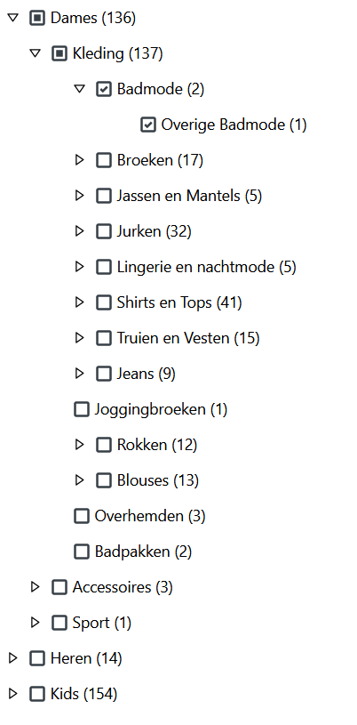

# Checkbox Tree

Building a simple checkbox tree application.

### Project setup

```bash
nvm use
yarn
```

### Usage

```bash
yarn dev
```

### Testing

```bash
yarn test
```

### Ui demo



### Techs

- [x] React Create App
- [x] Typescript
- [x] React hooks
- [x] Styled components + theming
- [x] React Testing Library
- [x] Mock server
- [x] React query
- [x] Code formatters
- [x] Pre-commit hooks
- [x] Absolute imports
